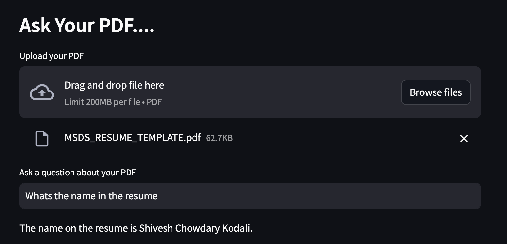

# Ask Your PDF

This Streamlit application allows users to ask questions about the content of a PDF document and receive relevant answers. The application utilizes natural language processing and question-answering techniques to extract information from the uploaded PDF.



## Getting Started

Follow the steps below to set up and run the application locally.

### Prerequisites

Make sure you have Python installed on your machine. You can download it from [python.org](https://www.python.org/downloads/).

### Installation

1. Clone the repository to your local machine:

2. Navigate to the project directory:

3. Obtain an API key from OpenAI by following the instructions on their [website](https://beta.openai.com/signup/).

4. Create a `.env` file in the project root directory and add your OpenAI API key:

   ```env
   OPENAI_API_KEY=your-api-key
   ```

### Usage

Run the application with the following command:

```bash
python app.py
```

This will start a local development server, and you can access the application by navigating to [http://localhost:8501](http://localhost:8501) in your web browser.

## Features

- Upload a PDF file.
- Ask questions about the PDF content.
- Receive relevant answers based on natural language processing.

## Dependencies

- `dotenv`: Load environment variables from a file.
- `streamlit`: Create interactive web applications for data science.
- `PyPDF2`: Read and manipulate PDF files.
- `langchain`: A library for natural language processing tasks.
- `OpenAI`: Access OpenAI's language models and embeddings.
- `FAISS`: A library for similarity search and clustering of dense vectors.

## License

This project is licensed under the [MIT License](LICENSE).
